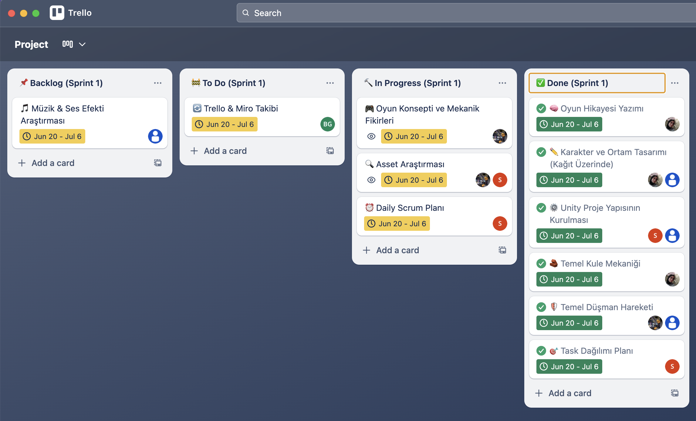

# Hold the Throne - Takım Projesi

## Takım İsmi

**Arcade V**

## Takım Logosu

## Takım Elemanları

|    | 
Name
            | 
Title
     | 
Socials
     |
| :-----------: | :------------------------------- | :---------------------------- | :-----------------------------------: |
|  | Ömer Faruk Özer     | Product Owner    |  |
|  | Serra Aktaş         | Scrum Master      |  |
|  | Burkay Gedik        | Developer         |  |
|  | Melike Demirkan     | Artist            |  |
|  | Özgenur Çiloğlu     | Designer          |  |

## Oyun İsmi

**Hold the Throne**

## Oyun Logosu

## Oyun Açıklaması

- **Hold the Throne**, heyecan dolu bir kule savunma oyunudur. Oyuncular, cesur komutanlar olarak, bilge Kral **Theron**'u kurnaz ve sayıca üstün goblin ordularının amansız saldırılarından korumakla görevlidir. Oyun, stratejik kule yerleştirme, kahraman yönetimi ve epik çatışmaları bir araya getiren bağımlılık yaratan bir deneyim sunar.

## Oyun Hikayesi

- Barış ve refah içinde yaşayan Krallık, beklenmedik bir tehditle karşı karşıyadır: Yeraltı tünellerinden çıkan açgözlü ve yaramaz goblinler! Kadim bir efsaneye göre, goblinler, Krallığın kalbinde bulunan ve sonsuz zenginlik barındırdığına inanılan Kraliyet Hazinesi'ni ele geçirmek istemektedir. Kurnaz liderleri **Grok**'un önderliğinde, goblin orduları dalga dalga Krallığa saldırmaktadır. Oyuncular, Kral **Theron**'un en güvendiği komutanlar olarak, stratejik savunma hatları kurarak, kahramanlarını doğru zamanda kullanarak ve özel büyülerle goblin istilasını püskürtmek zorundadır. Başarısızlık, Kralın tahtını kaybetmesi ve Krallığın karanlığa gömülmesi anlamına gelecektir.

## Oyun Özellikleri

- 3D  
- Tek oyunculu  
- Tür: Tower Defense / Strateji  
- (Diğer oyun özellikleri ileriki sprintlerde eklenecek)

## Hedef Kitle

- Bağımsız oyun severler (indie kitlesi)  
- Kule savunma ve strateji oyuncuları  
- 10 yaş ve üzeri oyuncular

## Pazarlama Planı

- **Steam Sayfası**: Yayın öncesi "wishlist" toplamak için etkili bir sayfa hazırlanacak.  
- **Sosyal Medya Tanıtımı**: Instagram, TikTok ve Twitter üzerinden karakter tanıtımları, animasyonlar ve mini hikâyeler paylaşılacak.  
- **Oyun Jami ve Etkinlik Katılımı**: Indie Game Jam'lerde demo tanıtımı yapılacak.  
- **YouTube / Influencer İşbirlikleri**: Tower Defense türüne odaklı YouTube kanallarıyla işbirlikleri yapılacak.  
- **Fiyatlandırma**: Uygun fiyatlı tek satın alım (premium model), ilk haftaya özel %30 indirim planlanıyor.  
- **Ek Gelir Kaynakları**: Oyun içi kozmetik içerikler (skin, kule efekti vb.), müzik albümü, fiziksel ürünler (tişört, poster, sticker).  
- **Steam Demo**: Oyunun kısa bir demosu Steam üzerinden ücretsiz yayınlanarak topluluk geri bildirimi toplanacak.

---

## Sprint 1

- **Sprint Notları**: Sprint 1’de temel oyun fikri netleştirildi, görev dağılımı yapıldı ve oyunun iskeleti oluşturulmaya başlandı.  
- **Sprint içinde tamamlanması tahmin edilen puan**: 100  
- **Puan tamamlama mantığı**: Üç sprint'e eşit dağılacak şekilde her sprint için ortalama 100 puanlık iş planlandı.  
- **Backlog düzeni ve Story seçimleri**:  
  - 🎵 *Müzik & Ses Efekti Araştırması* - Backlog’da yer aldı.  
  - 📝 *Trello & Miro Takibi* - To Do’ya alındı.  
  - 🎮 *Oyun Konsepti ve Mekanik Fikirleri*, 🔍 *Asset Araştırması*, 📅 *Daily Scrum Planı* - In Progress durumunda işlendi.  
  - 🧠 *Oyun Hikayesi Yazımı*, ✏️ *Karakter ve Ortam Tasarımı (Kağıt Üzerinde)*, ⚙️ *Unity Proje Yapısının Kurulması*, 🛡️ *Temel Kule Mekaniği*, 🧟 *Temel Düşman Hareketi*, ✅ *Task Dağılımı Planı* - Done listesine taşındı.  
- **Daily Scrum**: Discord üzerinden her akşam 21:00’de gerçekleştirildi.  
  - 📸 Ekran görüntüleri için: [Daily Scrum Chat Albümü (Imgur)](https://imgur.com/a/EquKCRM)
- **Sprint board bağlantısı**:  
  🔗 [Sprint 1 - Trello Board](https://trello.com/invite/b/6868dcd924e6f218d86386c4/ATTI17fabb40888a2ac62083c5ae96fd3f6195B10BE3/project)
- **Sprint board update**:  
    
(05/07/2025 17:16)

---

### 📸 **Ekran Görüntüleri**

#### 🔧 Temel Mekanik Kodları

 
<i>Code1 - Kule yerleştirme mekanizması</i>

  

 
<i>Code2 - Düşman spawn sistemi</i>

  

 
<i>Code3 - Kule saldırı sistemi</i>

---

#### 🎬 Oynanıştan Görüntü

 
<i>Unity sahnesinden canlı önizleme (GIF)</i>

---

- **Sprint Review**:  
  - Takım olarak görevler başarılı şekilde tamamlandı. Konsept, görev dağılımı, temel mekaniğin yazılması ve Unity proje yapısı gibi kritik adımlar tamamlandı.  
- **Sprint Retrospective**:  
  - Herkes rol süreci aktif bir şekilde yönetti hatta rollerimiz dışına çıkılarak ekstra görevler de yapıldı.  
  - Bir sonraki sprintte teknik detaylar (saldırı sistemleri, pathfinding vb.) öncelik olarak belirlendi.  
  - Ekip içinde iletişim güçlüydü ve görevler zamanında tamamlandı.

---

## Sprint 2

- **Sprint Notları**: Sprint 2’de temel sistemler geliştirilmeye devam edildi. Unity üzerinde mekanik sistemler detaylandırıldı, düşman yapay zekası geliştirildi ve asset entegrasyonları başladı. Ayrıca görev takibi sıklaştırıldı ve görsel tasarımlar dijital ortama taşındı.

- **Sprint içinde tamamlanması tahmin edilen puan**: 100  
- **Puan tamamlama mantığı**: Her sprint için ortalama 100 puan üzerinden değerlendirme yapılmakta. Sprint 2 bu hedefe ulaşmıştır.  

- **Backlog düzeni ve Story seçimleri**:  
  - 📦 *Asset Araştırması* - In Progress  
  - ✅ *Trello Takibi*  
  - 📅 *Daily Scrum Planı*  
  - ⚙️ *Unity Mekanik Geliştirme*  
  - 🔄 *Asset'leri Entegre Etme*  
  - 🛡️ *Kule Mekaniğini Geliştirme*  
  - 🧟 *Düşman Mekaniğini Geliştirme*  
  - ✅ *Task Dağılım Planı*

- **Daily Scrum**: Discord üzerinden her akşam 21:00’de gerçekleştirildi.  
  - 📸 Ekran görüntüleri için: [Daily Scrum Chat Albümü (Imgur)](https://imgur.com/a/yV4t8BR)

- **Sprint board bağlantısı**:  
  🔗 [Sprint 2 - Trello Board](https://trello.com/invite/b/6868dcd924e6f218d86386c4/ATTI17fabb40888a2ac62083c5ae96fd3f6195B10BE3/project)

- **Sprint board update**:  
  
  (20/07/2025 19:01)

---

### 📸 **Ekran Görüntüleri**

#### ⚙️ Geliştirilmiş Mekanikler

 
<i>Tower shooting sistemi</i>

  

 
<i>Geliştirilmiş düşman & kule etkileşimi</i>

---

#### 🎨 Görsel Tasarımlar

 
<i>Çevre ve karakter tasarımlarının dijitalleştirilmesi</i>

  

 
<i>Yeni level design süreci</i>

---

- **Sprint Review**:  
  - Unity üzerinde temel mekaniklerin üzerine yenileri eklendi. Düşman hareketi, kule saldırısı gibi sistemler tamamlandı. Pixel art karakter ve çevre tasarımları dijitale aktarıldı.  

- **Sprint Retrospective**:  
  - Ekip görev paylaşımına sadık kaldı. Görev dağılım planı geliştirildi. İletişim yine güçlüydü. Teknik sorunlar Trello ve Discord üzerinden hızlıca çözüldü. Bir sonraki sprintte optimizasyon, oyun içi UI ve seviye geçiş sistemine ağırlık verilmesi planlanmakta.

---

# Sprint 3

## Sprint Notları:
Sprint 3, oyunun final sürümünün oluşturulmasına odaklandı. Önceki sprintlerde geliştirilen tüm sistemler birleştirildi; UI, ses ve görseller tamamlandı. Tanıtım videosu hazırlandı ve proje sunuma uygun hâle getirildi. Görevler Trello üzerinden kartlara ayrılarak takip edildi.

## Sprint içinde tamamlanması tahmin edilen puan:
*100 Puan*

## Puan tamamlama mantığı:
Proje toplamda 300 puanlık iş üzerinden planlandı. Sprint 3 için de 100 puanlık iş hedefi belirlendi.

## Backlog düzeni ve Story seçimleri:
Bu sprintte görevler oyunu "final product" hâline getirmek amacıyla dağıtıldı. Trello üzerinden kartlar oluşturularak görev takibi yapıldı. Yazılım, tasarım, ses ve sunum görevleri bu süreçte paralel şekilde yürütüldü.

## Daily Scrum:
Whatsapp üzerinden yapıldı. Günlük ilerlemeler, engeller ve ihtiyaç duyulan destekler bu toplantılarda ele alındı.  
📁 *Sprint 3 - Daily Scrum Chats:* [https://imgur.com/a/Hwfx1DZ](https://imgur.com/a/Hwfx1DZ)

## Sprint board bağlantısı:
[Sprint Board](https://trello.com/invite/b/6868dcd924e6f218d86386c4/ATTI17fabb40888a2ac62083c5ae96fd3f6195B10BE3/project)

## Sprint board update:

- Final sahne entegrasyonu  
- Kullanıcı arayüzü ve UI detayları  
- Oynanış videosu kurgu süreci  

📸 *Ekran Görüntüleri* [https://imgur.com/a/zmsuOLb](https://imgur.com/a/zmsuOLb) 

## Sprint Review:
- Kodlar tek sahnede birleştirildi  
- Level design tamamlandı  
- UI sahneye entegre edildi  
- Telifsiz müzik ve ses efektleri oyuna eklendi  
- Tanıtım videosu kurgu yazılımında hazırlandı  
- 100 puanlık sprint hedefi tamamlandı

## Sprint Retrospective:
- Roller dışında da destek verilerek takım çalışması güçlendirildi  
- Görevler zamanında ve eksiksiz tamamlandı  
- Final sunumuna uygun, oynanabilir ve gösterilebilir bir ürün ortaya kondu
